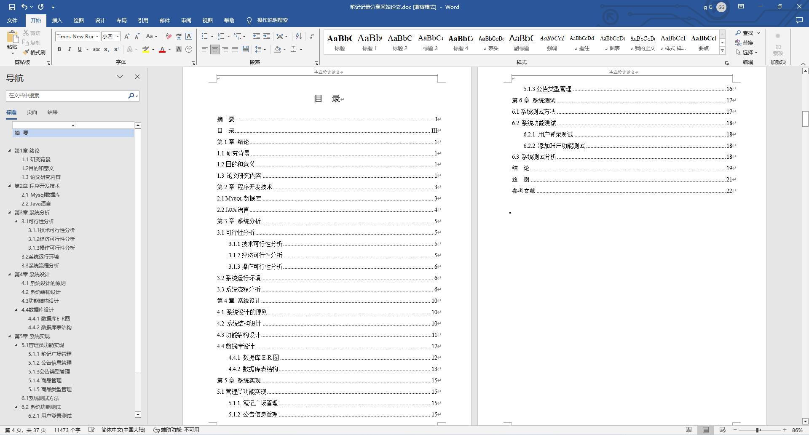
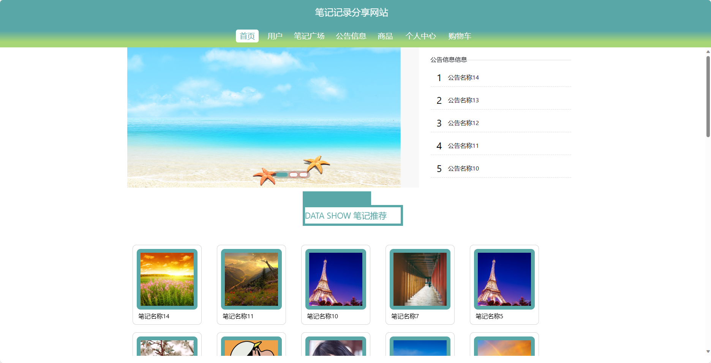
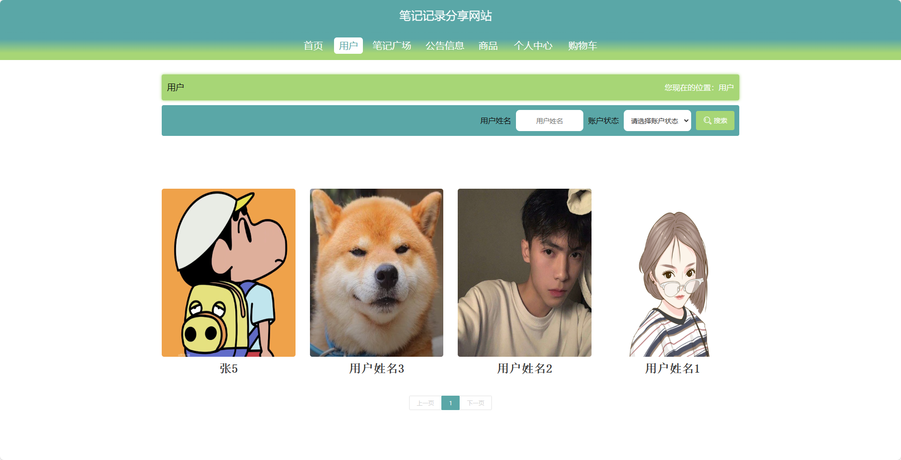
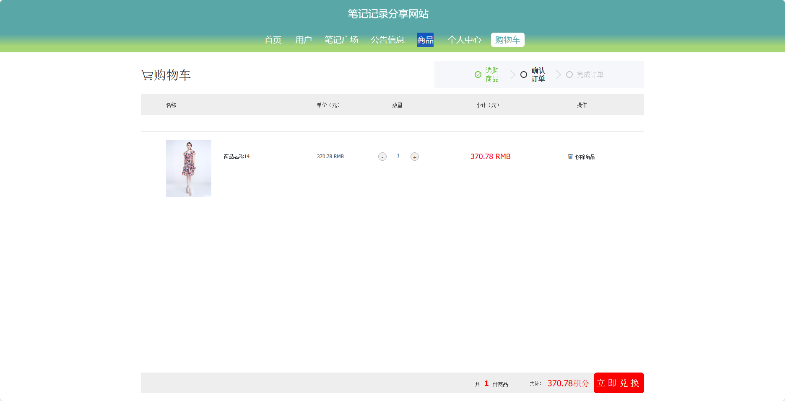
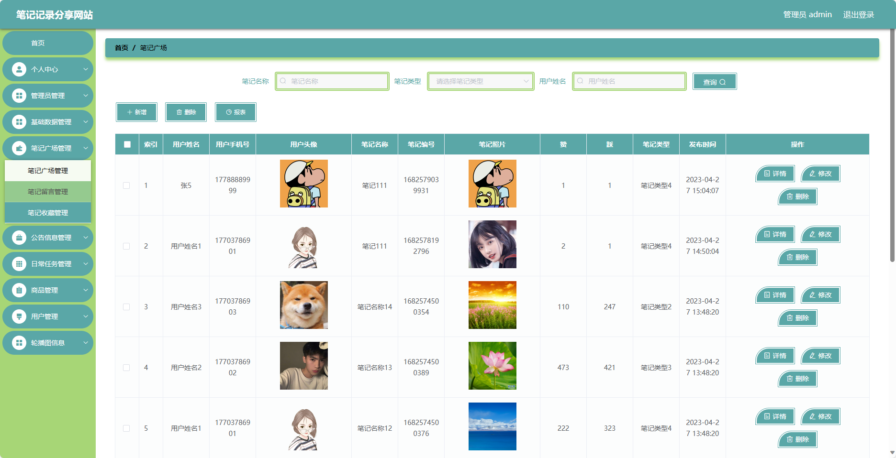

基于SpringBoot的笔记记录分享网站（程序+论文）
=
- 完整代码获取地址：从戎源码网 ([https://armycodes.com/](https://armycodes.com/))
- 作者微信：19941326836  QQ：952045282 
- 承接计算机毕业设计、Java毕业设计、Python毕业设计、深度学习、机器学习
- 选题+开题报告+任务书+程序定制+安装调试+论文+答辩ppt 一条龙服务
- 所有选题地址https://github.com/nature924/allProject

一、项目介绍
---
基于Spring Boot框架实现的笔记记录分享网站，系统包含两种角色：管理员、用户,系统分为前台和后台两大模块，主要功能如下。

### 前台：
- 首页：展示网站的基本信息、热门笔记、公告等内容。
- 用户：展示注册用户的个人信息和活跃度等。
- 公告信息：展示网站发布的最新公告和通知。
- 笔记广场：用户可以在此发布和分享自己的笔记记录。
- 商品：展示网站相关的商品信息。
- 个人中心：用户可以管理个人信息、查看自己的笔记记录等。
- 购物车：用户可以将感兴趣的商品加入购物车。

### 后台：
- 管理员个人中心：管理员可以管理个人信息，包括修改密码、查看个人信息等。
- 管理员管理：管理员可以管理其他管理员账号，包括添加、删除、编辑等操作。
- 基础数据管理：管理员可以管理系统的基础数据，如网站配置、分类信息等。
- 笔记广场管理：管理员可以管理笔记广场的内容，包括审核、删除违规内容等操作。
- 公告信息管理：管理员可以管理网站发布的公告信息，包括添加、删除、编辑等操作。
- 日常任务管理：管理员可以管理网站的日常任务，如定时备份、数据清理等。
- 商品管理：管理员可以管理网站的商品信息，包括上架、下架、编辑商品信息等操作。
- 用户管理：管理员可以管理用户账号，包括查看用户列表、禁用用户等操作。
- 轮播图信息：管理员可以管理首页轮播图的展示内容。

二、项目技术
---
- 编程语言：Java
- 数据库：MySQL
- 项目管理工具：Maven
- 前端技术：VUE、HTML、Jquery、Bootstrap
- 后端技术：Spring、SpringMVC、MyBatis

三、运行环境
---
- 操作系统：Windows、macOS都可以
- JDK版本：JDK1.8以上都可以
- 开发工具：IDEA、Ecplise、Myecplise都可以
- 数据库: MySQL5.7以上都可以
- Tomcat：任意版本都可以
- Maven：任意版本都可以

四、运行截图
---
### 论文截图：

### 程序截图：

